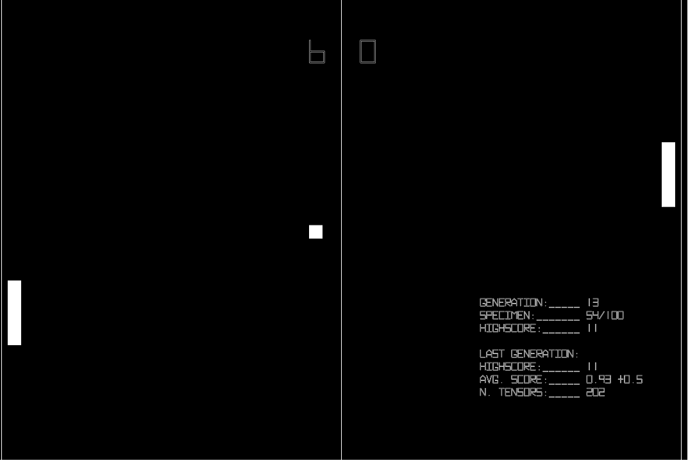

# Pong Machine Learning with p5.js and TensorFlow.js

Install
```
$ npm install
```

Start
```
$ npm start
```


The start of first generation


A sample of a good player

> To continue to run a saved generation or repeat the best specimen put the saved file into the static folder

## References
- [p5.js](https://p5js.org/)
- [TensorFlow.js](https://js.tensorflow.org)

And a big thanks to this channels that teached me a lot
- [CodingTrain](https://www.youtube.com/user/shiffman/videos)
- [Siraj Raval](https://www.youtube.com/channel/UCWN3xxRkmTPmbKwht9FuE5A)
