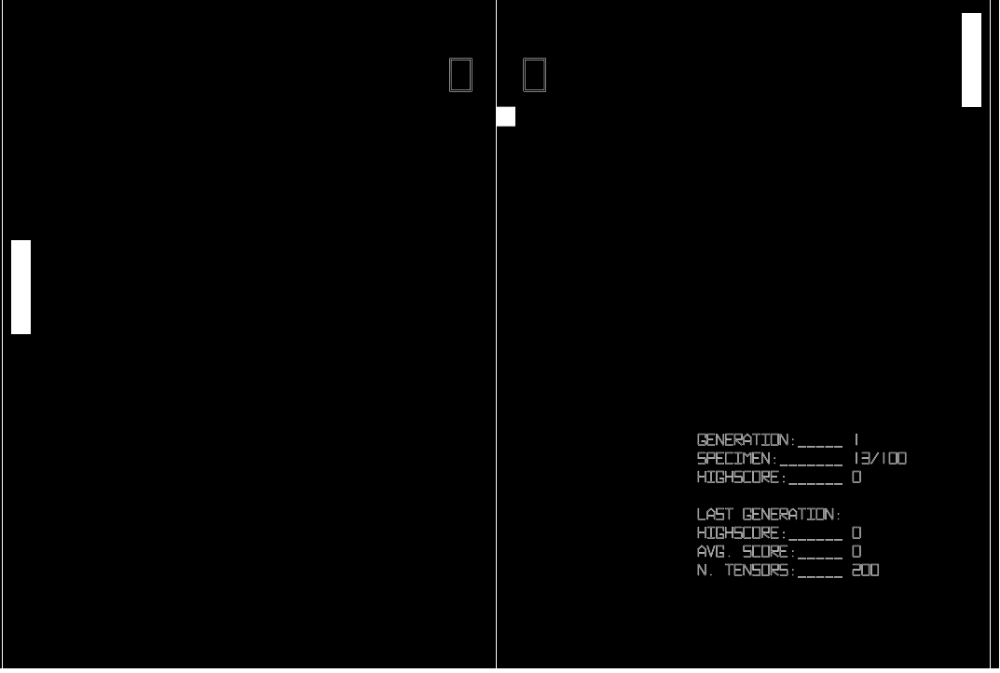

# Pong Machine Learning with p5.js and TensorFlow.js

You can run access the GitHub Page [here](https://adrianomoura.github.io/PongAI/) and try it (the save and load buttons wont work on the GitHub Pages version, you need to run it locally)

If you want to clone and run it yourself 

Install (use the node version 8.17.0 and npm 6.13.4)
```
$ npm install
```

Start
```
$ npm start
```



The start of first generation


A sample of a good player

> To continue to run a saved generation or repeat the best specimen put the saved file into the static folder

## References
- [p5.js](https://p5js.org/)
- [TensorFlow.js](https://js.tensorflow.org)

And a big thanks to this channels that teached me a lot
- [CodingTrain](https://www.youtube.com/user/shiffman/videos)
- [Siraj Raval](https://www.youtube.com/channel/UCWN3xxRkmTPmbKwht9FuE5A)
